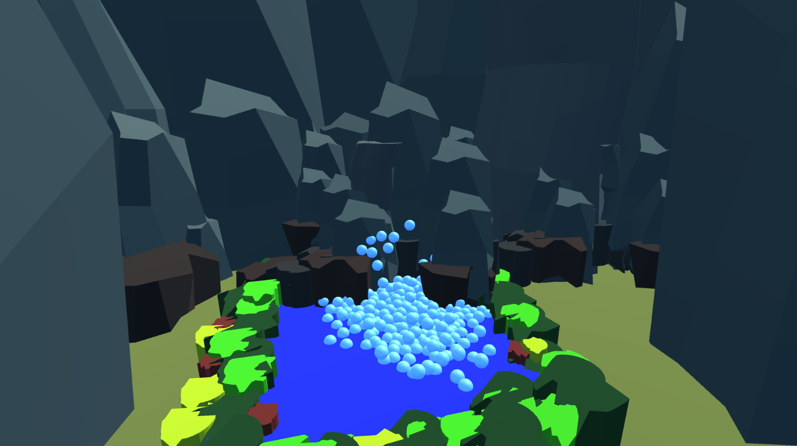
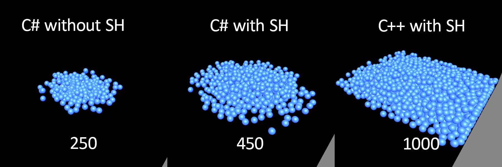

# Smoothed Particle Hydrodynamics in Unity
My final year Creative Technologies Project for Games Technology at UWE Bristol.
Showcase video available at: The video will be made available in May 2020.

This is an implementation of the SPH method inside of Unity, suitable for use in game scenes.

The implementation uses 3 methods, differences between which is shown in the image below.
Left - C# SPH without spatial hashing. Number of particles at 60FPS - 300.
Middle - C# SPH with spatial hashing. Number of particles at 60FPS - 450.
Right - C++ DLL integration with C#. Number of particles at 60FPS - 1000.

The Unity project contains a gameplay environemnt scene - the one in the showcase image and a SPHShowcase scene where the 3 benchmarks are compared. Each implementation requires a different script, while the C++ implementation requires a script and the DLL. A project to build the DLL is also provided under the sphdll folder. 
